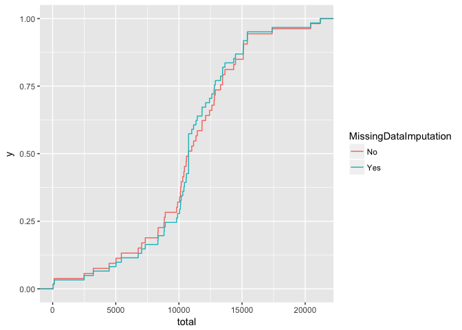

Reproducible Research - Project 1
==================================

Load Data
Process/transform the data (if necessary) into a format suitable for your analysis


```r
library(ggplot2)
library(plyr)
library(lubridate)
```

```
## 
## Attaching package: 'lubridate'
```

```
## The following object is masked from 'package:plyr':
## 
##     here
```

```
## The following object is masked from 'package:base':
## 
##     date
```

```r
options(scipen=999)
Activity <- read.csv("activity.csv",stringsAsFactors=FALSE)
Activity_noNA <- subset(Activity, is.na(Activity$steps) == FALSE)
```

Change date(numeric) in data into an actual date format

```r
Activity$date <- ymd(Activity$date)
Activity_noNA$date <- ymd(Activity_noNA$date)
```


Question 1
==========
What is mean total number of steps taken per day?
For this part of the assignment, you can ignore the missing values in the dataset.
1	Calculate the total number of steps taken per day

```r
StepsByDate <- ddply(Activity_noNA, .(date), summarize, total = sum(steps, na.rm=TRUE))
```

3	Calculate and report the mean and median of the total number of steps taken per day

```r
MeanSteps <- round(mean(StepsByDate$total), digits=2)
MedianSteps <- round(median(StepsByDate$total), digits=2)
```
The mean is 10766.19 and the median is 10765.

2	If you do not understand the difference between a histogram and a barplot, research the difference between them. Make a histogram of the total number of steps 	taken each day


```r
ggplot(StepsByDate,aes(x=date,y=total)) +
geom_histogram(stat="identity") +
theme_bw() +
xlab("Dates")+ 
ylab("Total number of Steps")+ 
labs(title="Total numbers of Steps per day") +
geom_hline(aes(yintercept = MeanSteps, colour = "Mean",linetype= "Mean",show.legend=TRUE)) +
geom_hline(aes(yintercept = MedianSteps, colour = "Median",linetype= "Median",show.legend=TRUE)) +
scale_colour_manual(name="Legend", values=c("Mean"="red","Median"="blue"))+
scale_linetype_manual(name="Legend",values=c("Mean"="solid","Median"="dashed"))
```

```
## Warning: Ignoring unknown parameters: binwidth, bins, pad
```

```
## Warning: Ignoring unknown aesthetics: show.legend

## Warning: Ignoring unknown aesthetics: show.legend
```

<!-- -->

The mean is 10766.19 and the median is 10765 and both nearly overlap each other. 


Question 2
===========
What is the average daily activity pattern?
1 Make a time series plot (i.e. .𝚝𝚢𝚙𝚎 = "𝚕") of the 5-minute interval (x-axis) and the average number of steps taken, averaged 	across all days (y-axis)

```r
StepsByInterval <- ddply(Activity, .(interval), summarize, mean_steps = mean(steps, na.rm=TRUE))
	
	
	
plot(StepsByInterval$interval, 
     StepsByInterval$mean_steps, 
     type="l", 
     col="black", 
     lwd=2, 
     xlab="Interval [minutes]", 
     ylab="Average number of steps", 
     main="Time-series of the average number of steps per 5min intervals\n(NA removed)")
```

<!-- -->

2	Which 5-minute interval, on average across all the days in the dataset, contains the maximum number of steps?

```r
maxNumber <- which(StepsByInterval$mean_steps == max(StepsByInterval$mean_steps))
maxInterval <- StepsByInterval[maxNumber, 1]
```
The time interval that contains the max number of steps is 835


Question 3
===========
Imputing missing values
Note that there are a number of days/intervals where there are missing values (coded as 𝙽𝙰). The presence of missing days may introduce bias into some calculations or summaries of the data.
1	Calculate and report the total number of missing values in the dataset (i.e. the total number of rows with 𝙽𝙰s)

```r
NAsum <- sum(is.na(Activity$steps))
```
The total number of missing values is 2304


2	Devise a strategy for filling in all of the missing values in the dataset. The strategy does not need to be sophisticated. 	For example, you could use the mean/median for that day, or the mean for that 5-minute interval, etc.

```r
NANumber <- which(is.na(Activity$steps))
NAFiller <- rep(mean(Activity$steps, na.rm=TRUE), times=length(NANumber))
```

3	Create a new dataset that is equal to the original dataset but with the missing data filled in.

```r
Activity2 <-Activity
Activity2[NANumber, "steps"] <- NAFiller
```
	
4b Calculate and report the mean and median total number of steps taken per day. 

```r
StepsByDate_NAfilled <- ddply(Activity2, .(date), summarize, total=sum(steps,na.rm=TRUE))
MeanNAFilled <- round(mean(StepsByDate_NAfilled$total), digits=2)
MedianNAFilled <- round(median(StepsByDate_NAfilled$total), digits=2)
```
The new mean is 10766.19 and the new median is 10766.19.

	
4a	Make a histogram of the total number of steps taken each day 

```r
ggplot(StepsByDate_NAfilled,aes(x=date,y=total)) +
geom_histogram(stat="identity")+
theme_bw() +
xlab("Dates")+ 
ylab("Total number of Steps (NA filled)")+ 
labs(title= expression("Total numbers of Steps per day(NA filled)"))+
geom_hline(aes(yintercept =MeanNAFilled, colour = "Mean",linetype= "Mean"))+
geom_hline(aes(yintercept = MedianNAFilled, colour = "Median",linetype= "Median"))+
scale_colour_manual(name="Legend", values=c("Mean"="red","Median"="blue"))+
scale_linetype_manual(name="Legend",values=c("Mean"="solid","Median"="dashed"))
```

```
## Warning: Ignoring unknown parameters: binwidth, bins, pad
```

<!-- -->
The new mean is 10766.19 and the new median is 10766.19. They are the same and they overlap on the graph


4c Do these values differ from the estimates from the first part of the assignment? 

```r
mean(StepsByDate$total)==mean(StepsByDate_NAfilled$total)
```

```
## [1] TRUE
```

```r
median(StepsByDate$total)==mean(StepsByDate_NAfilled$total)
```

```
## [1] FALSE
```
No, the values are very similar to the first part of the assignment.

4d What is the impact of imputing missing data on the estimates of the total daily number of steps?	

```r
summary(StepsByDate)
```

```
##       date                total      
##  Min.   :2012-10-02   Min.   :   41  
##  1st Qu.:2012-10-16   1st Qu.: 8841  
##  Median :2012-10-29   Median :10765  
##  Mean   :2012-10-30   Mean   :10766  
##  3rd Qu.:2012-11-16   3rd Qu.:13294  
##  Max.   :2012-11-29   Max.   :21194
```

```r
summary(StepsByDate_NAfilled)
```

```
##       date                total      
##  Min.   :2012-10-01   Min.   :   41  
##  1st Qu.:2012-10-16   1st Qu.: 9819  
##  Median :2012-10-31   Median :10766  
##  Mean   :2012-10-31   Mean   :10766  
##  3rd Qu.:2012-11-15   3rd Qu.:12811  
##  Max.   :2012-11-30   Max.   :21194
```

```r
StepsByDate$MissingDataImputation <- "No"
StepsByDate_NAfilled$MissingDataImputation <- "Yes"

AllStepsByDate <- rbind(StepsByDate,StepsByDate_NAfilled)
ggplot(AllStepsByDate, aes(total,colour = MissingDataImputation)) + 
  stat_ecdf()
```

<!-- -->

Impact of imputing the missing values
Missing values do not change the data structure. Shape of histogram and cumulative distribution curve is still generally the same. The imputation of missing values affect very slightly the lower total step numbers since the value for imputation is much lower than the mean/median of the whole population. The imputation can be safely utilised for downstream data analysis and processing.


Question 5
===========

Are there differences in activity patterns between weekdays and weekends?
For this part the 𝚠𝚎𝚎𝚔𝚍𝚊𝚢𝚜() function may be of some help here. Use the dataset with the filled-in missing values for this part.

1 Create a new factor variable in the dataset with two levels – “weekday” and “weekend” indicating whether a given date is a weekday or weekend day.


```r
Activity2<- data.frame(date=Activity2$date, 
weekday=tolower(weekdays(Activity2$date)), 
steps=Activity2$steps, 
interval=Activity2$interval)

Activity2 <- cbind(Activity2, 
daytype=ifelse(Activity2$weekday == "saturday" | 
Activity2$weekday == "sunday", "weekend", 
"weekday"))

Activity3 <- data.frame(date=Activity2$date, 
weekday=Activity2$weekday, 
daytype=Activity2$daytype, 
interval=Activity2$interval,
steps=Activity2$steps)
```


2 Make a panel plot containing a time series plot (i.e. 𝚝𝚢𝚙𝚎 = "𝚕") of the 5-minute interval (x-axis) and the average number of steps taken, averaged across all weekday days or weekend days (y-axis). See the README file in the GitHub repository to see an example of what this plot should look like using simulated data.


```r
StepsByInterval_NAfilled <- ddply(Activity3, .(interval,daytype), summarize, mean_steps = mean(steps, na.rm=TRUE))

ggplot(StepsByInterval_NAfilled, aes(interval, mean_steps)) +
geom_line(stat = "identity", aes(colour = daytype)) +
theme_bw() +
facet_grid(daytype ~ ., scales="fixed", space="fixed") +
labs(x="Interval", y=expression("No of Steps")) +
ggtitle("No of steps Per Interval by day type")
```

<!-- -->
